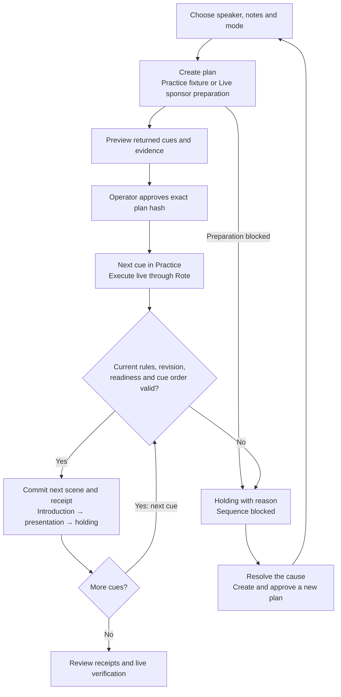
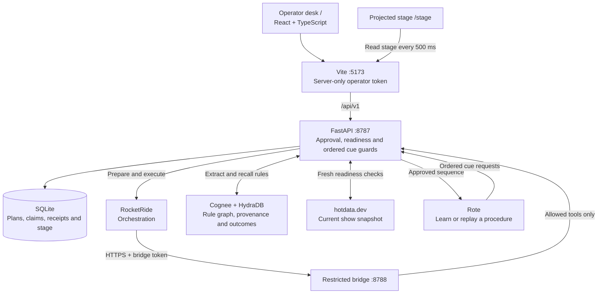

# CuePilot

**Rehearse once. Reuse safely.**

CuePilot is a live-show director that learns a rehearsed cue sequence and reuses
it for another speaker. The operator approves the plan; the backend checks current
conditions before every stage change. A missing presentation sends the show to
holding with a clear reason.

**One segment. Three speakers. One stage.** Introduction → presentation → holding.

[Pitch preview (PDF)](output/presentation/CuePilot-Demo.pdf) ·
[PowerPoint](output/presentation/CuePilot-Demo.pptx) ·
[Demo walkthrough](docs/demo-recording.md) ·
[Verification](docs/sponsor-readiness.md)

## The product

The **operator desk** at `/` combines speaker selection, production notes, plan
approval, a program preview and execution receipts. The projected **stage** at
`/stage` renders the API's current scene. Both use the same state; the browser
never invents playback progress or sponsor success.

| Mode | What actually happens |
| --- | --- |
| **Local API · Practice** | Local UI rehearsal: a fixture plan, operator approval and three real API stage cues with durable receipts. No sponsor execution claim. |
| **Local API · Live** | Verified sponsor preparation and Rote learning/replay. Missing setup or evidence blocks progress. |
| **Fixture data** | Explicitly labelled browser fixtures for UI rehearsal. Separate local state; never a fallback for failed API requests. |

## Product flow



Live execution checks every cue automatically. Practice advances one cue per
operator action. Restoring an asset never resumes an invalidated plan.

## System diagram



The API owns stage truth. Each cue transaction checks approval, show revision,
asset readiness, order and ownership before writing its receipt. Retrying the
same cue request ID returns its original receipt. Cancellation holds the stage
and preserves committed receipts.

The desk polls show, stage and its selected run every 500 ms. Read-only GETs need
no token. The loopback Vite proxy adds authentication to mutations; credentials
never enter the client bundle. [Architecture details →](docs/cuepilot-architecture.md)

## Run locally

Prerequisites: **Python 3.12, Node.js and pnpm**. Package-manager versions are pinned
in the root and frontend manifests. Practice needs no sponsor accounts.

```sh
git clone https://github.com/jayeshsuyal/cuepilot.git
cd cuepilot
python3.12 -m venv sponsor-setup/memory/.venv
sponsor-setup/memory/.venv/bin/python -m pip install -r cuepilot/requirements.txt
pnpm --dir cuepilot/web install --frozen-lockfile

# Terminal 1: start the API on 127.0.0.1:8787
sponsor-setup/memory/.venv/bin/python -m cuepilot.api
```

On first startup the API creates `cuepilot/.env`. Privately copy only its
`CUEPILOT_OPERATOR_TOKEN` value into `cuepilot/web/.env.local` using the same
variable name. Both files are ignored. Never use a `VITE_` prefix for this secret.

```sh
# Terminal 2, from the repository root
pnpm --dir cuepilot/web dev
```

Open the [desk](http://127.0.0.1:5173/) and
[stage](http://127.0.0.1:5173/stage) in separate windows. Restart Vite after changing
the token. Use `pnpm dev` for the authenticated proxy; `pnpm preview` serves static
files only. [Full frontend guide →](cuepilot/web/README.md)

### Try the safety demo

1. Select **Local API → Practice**, choose a speaker and **Create practice run**.
2. Preview the three cues, **Approve plan**, then press **Next cue** three times.
3. Create and approve another run. Advance the introduction, then turn off
   **Presentation**. Observe the API's holding scene and rejection reason.
4. Restore presentation readiness, **Create recovery plan**, approve and advance.

For Live, complete [sponsor setup](SPONSOR_SETUP.md) and the
[restricted bridge setup](cuepilot/BRIDGE.md), then follow the
[live acceptance guide](cuepilot/ACCEPTANCE_RUNNER.md). A new machine needs private
credentials and its own learned Rote play.

## Evidence and limits

Recorded on the configured demo machine on **September 11, 2026, at 22:35 UTC**:

| Scenario | Recorded result |
| --- | --- |
| **Maya: learn** | Actual Rote learning; three matched canonical cue receipts. |
| **Ravi: reuse** | Same learned package, new speaker inputs and three new receipts. |
| **Alex: interrupt** | Presentation removed after introduction; one receipt retained, presentation blocked, stage holding. |

[Sponsor evidence](docs/sponsor-readiness.md) describes these runs. Physical cue
completion, Rote/Hydra verification and RocketRide orchestration are separate
checks. No speed or cost reduction is claimed.

The documented Snyk scans report zero source findings and zero reported frontend
or minimal Python-runtime dependency vulnerabilities. **Six root/optional setup dependency
advisories remain unresolved.** See [security scope and findings](SECURITY.md).

## Develop

```sh
pnpm --dir cuepilot/web build
pnpm --dir cuepilot/web verify:transport
pnpm --dir cuepilot/web verify:operator
pnpm --dir cuepilot/web format:check
sponsor-setup/memory/.venv/bin/python -m unittest discover -s cuepilot/tests -v

# Root dependencies support RocketRide checks and configured Live execution
pnpm install --frozen-lockfile
pnpm test:cuepilot:rocketride
pnpm check:cuepilot:pipeline
pnpm security:scan
```

| Area | Entry point |
| --- | --- |
| Frontend — oasb16 | [Operator desk and stage](cuepilot/web/README.md) |
| Backend and sponsors — Jayesh | [API](cuepilot/api.py), [handoff](cuepilot/TEAMMATE_HANDOFF.md) |
| Shared API | [Frozen v1 contract](cuepilot/contracts/api.ts) — coordinate changes |
| Acceptance | [Backend checks](docs/backend-acceptance.md), [frontend verification](cuepilot/web/VERIFICATION.md) |

Credentials, runtime databases, generated Rote plays and raw scan reports stay
local. Earlier Dock proposals under `docs/architecture/` are historical. Current
scope excludes streaming accounts, OBS, microphones, scheduling and multitenancy.
